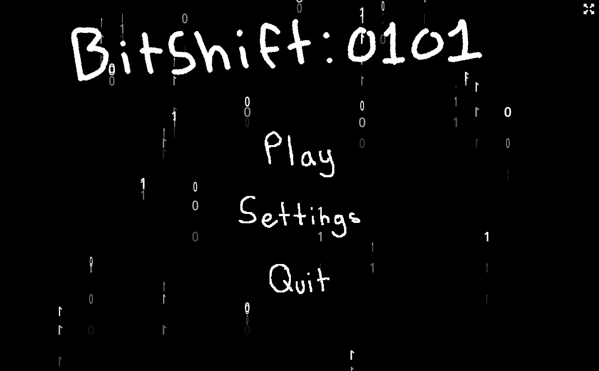
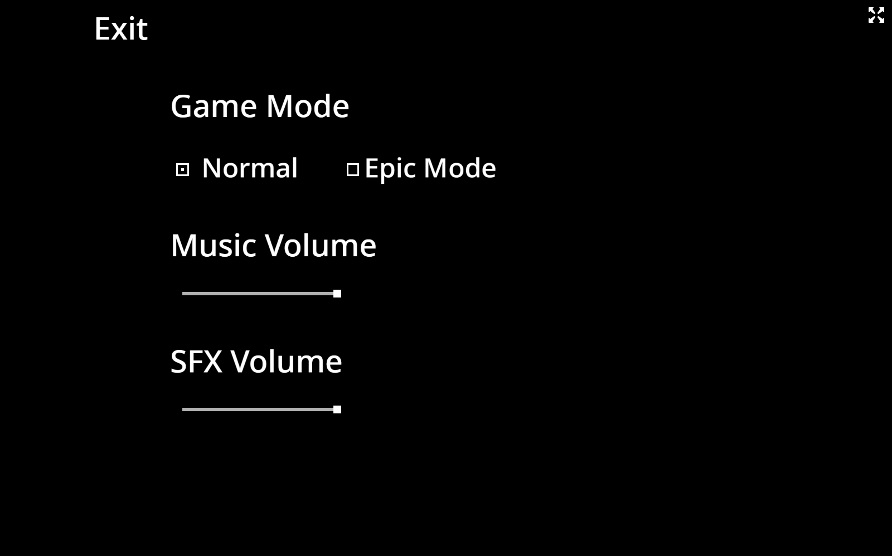
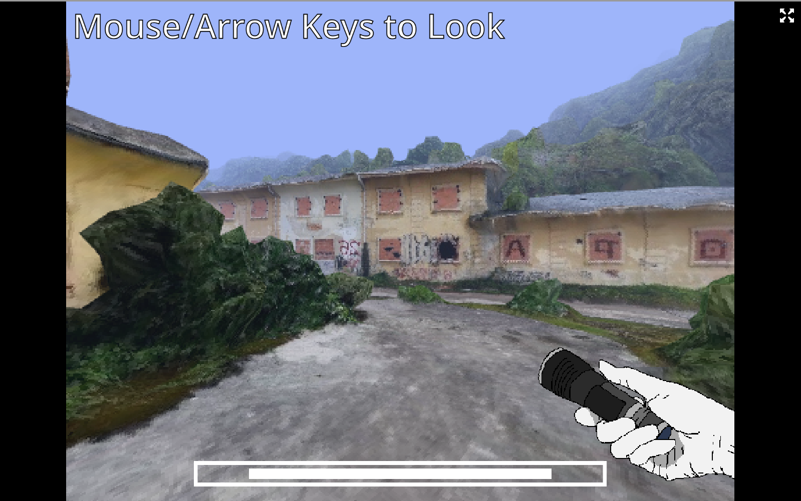
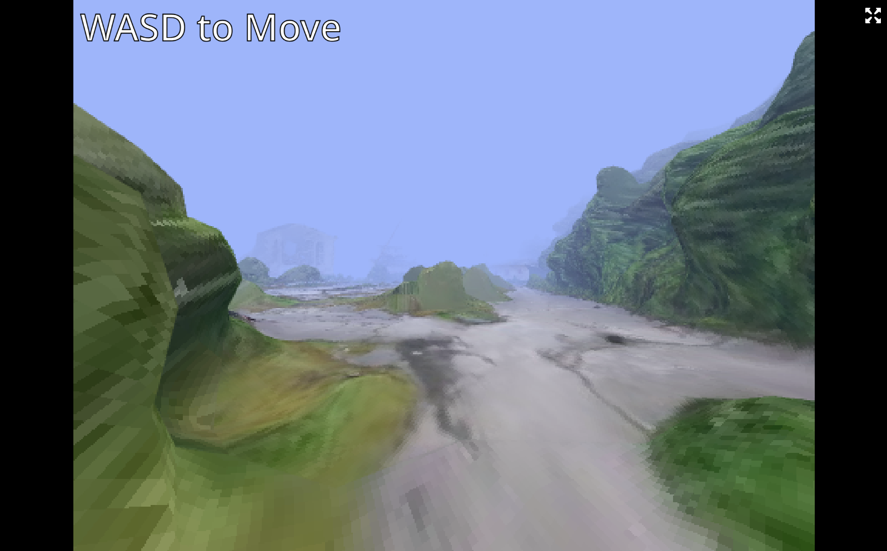
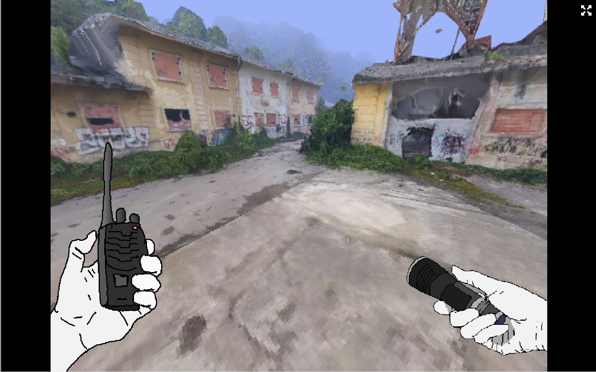
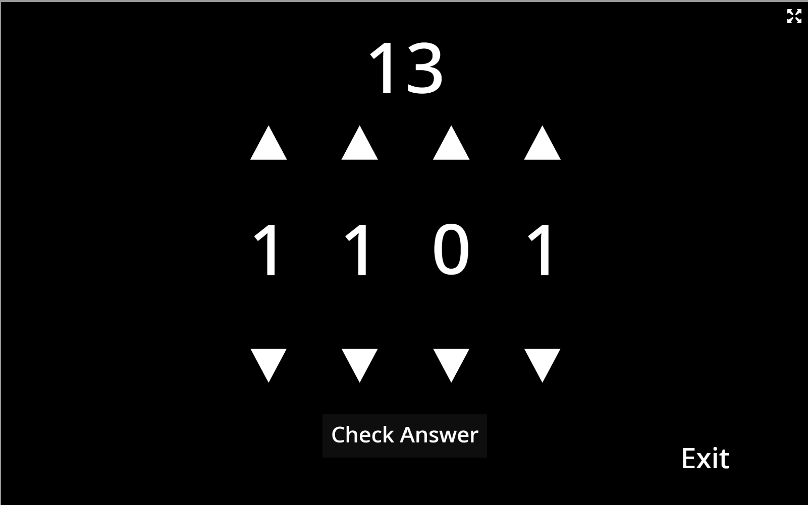
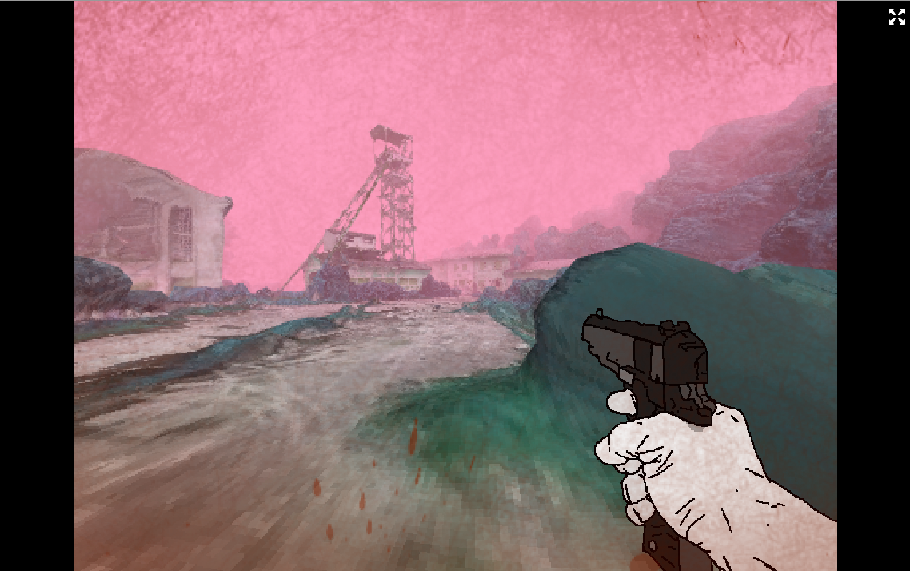

  <button class="arrow left">&#8592;</button>
  

    

      
      
      
      
      
      
      
    

  

  <button class="arrow right">&#8594;</button>

  
  
  
  
  
  
  

  View the full project on <a href="https://github.com/frogpants/Project-Bitshift" target="_blank">GitHub</a>.

<!-- Fullscreen Modal -->

  &times;
  

