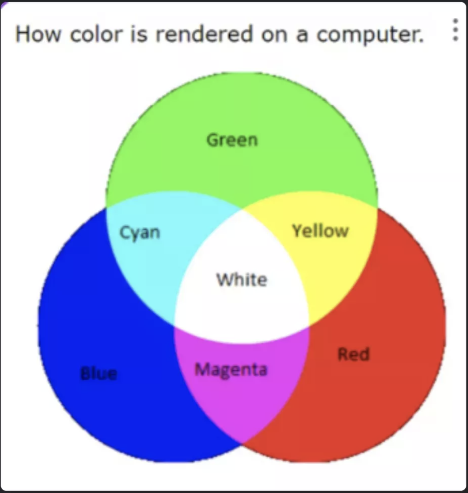

  <button class="arrow left">&#8592;</button>
  

    
    
    
    
  

  <button class="arrow right">&#8594;</button>

## Hands On Binary

This project is designed to teach binary in an engaging and interactive way using a hands-on 3D environment. Rather than relying on abstract concepts or traditional memorization, users will learn by directly manipulating objects that represent binary values. Whether it's flipping switches, stacking blocks, or activating machines, each action visually reinforces how binary works in computers. The goal is to make binary accessible to everyone—especially those who find the concept confusing at first but are curious and eager to understand how it powers the digital world around them.